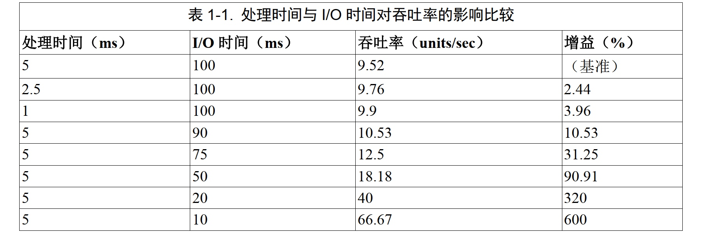
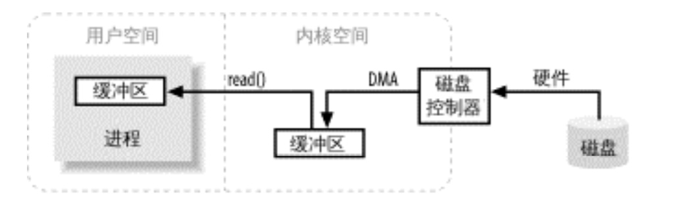
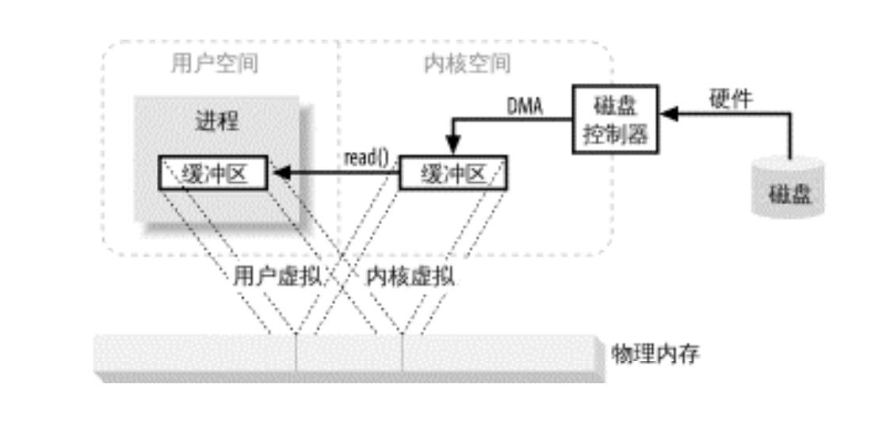
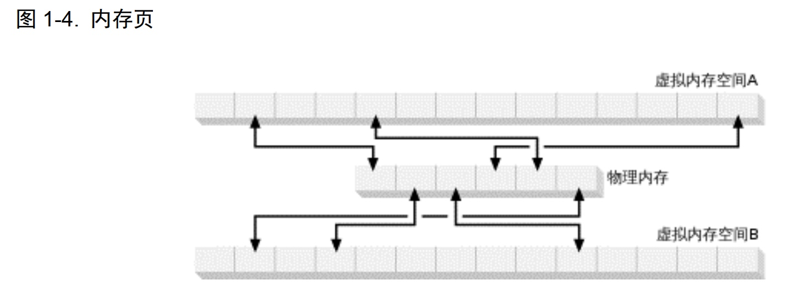

# NIO 学习 

# IO基础
## 1.io时间与cpu时间比较
表 1-1 所示为对数据单元进行磁盘读写所需时间的假设值。第一列为处理一个数据单元所需平均时间，第二列为对该数据单元进行磁盘读写所需时间，第三列为每秒所能处理的数据单元数，第四列为改变第一第二列的值所能产生的数据吞吐率的提升值。

前三行显示了处理阶段的效率提升会如何影响吞吐率。把单位处理时间减半，仅能提高吞吐率2.2％。而另一方面，仅仅缩短 I/O 延迟 10％，就可使吞吐率增加9.7％；把 I/O 时间减半，吞吐率几乎翻番。当您了解到 I/O 花在一个数据单元上的时间是处理时间的 20 倍，这样的结果就不足为奇了。

表中所列并非真实数据，目的只在说明相对时间度量，现实情况绝非如此简单。正如您所看到的，影响应用程序执行效率的限定性因素，往往并非处理速率，而是 I/O。程序员热衷于调试代码， I/O 性能的调试往往被摆在第二位，甚至完全忽略。殊不知，在 I/O 性能上的小小投入就可换来可观的回报，想来实在令人惋惜

## 2.CPU已不再是束缚

如今在运行时优化方面， JVM 已然前进了一大步。现在 JVM 运行字节码的速率已经接近本地编译代码，借助动态运行时优化，其表现甚至还有所超越。这就意味着，多数 Java 应用程序已不再受 CPU 的束缚（把大量时间用在执行代码上），而更多时候是受 I/O 的束缚（等待数据传输）。

然而，在大多数情况下， Java 应用程序并非真的受着 I/O 的束缚。操作系统并非不能快速传送数据，让 Java 有事可做；相反，是 JVM 自身在 I/O 方面效率欠佳。操作系统与 Java 基于流的 I/O模型有些不匹配。操作系统要移动的是大块数据（缓冲区），这往往是在硬件直接存储器存取（DMA）的协助下完成的。而 JVM 的 I/O 类喜欢操作小块数据——单个字节、几行文本。结果，操作系统送来整缓冲区的数据， java.io 的流数据类再花大量时间把它们拆成小块，往往拷贝一个小块就要往返于几层对象。操作系统喜欢整卡车地运来数据， java.io 类则喜欢一铲子一铲子地加工数据。有了NIO，就可以轻松地把一卡车数据备份到您能直接使用的地方(ByteBuffer对象)。

这并不是说使用传统的 I/O 模型无法移动大量数据——当然可以（现在依然可以）。具体地说,RandomAccessFile 类在这方面的效率就不低，只要坚持使用基于数组的 read( )和 write( )方法。这些方法与底层操作系统调用相当接近，尽管必须保留至少一份缓冲区拷贝

## 3.IO基础概念
* 缓冲区操作
* 内核空间与用户空间
* 虚拟内存
* 分页技术
* 面向文件的 I/O 和流 I/O
* 多工 I/O（就绪性选择）

### 3.1缓冲区操作

上图 简单描述了数据从外部磁盘向运行中的进程的内存区域移动的过程。进程使用read( )系统调用，要求其缓冲区被填满。内核随即向磁盘控制硬件发出命令，要求其从磁盘读取数据。磁盘控制器把数据直接写入内核内存缓冲区，这一步通过 DMA 完成，无需主 CPU 协助。一旦磁盘控制器把缓冲区装满，内核即把数据从内核空间的临时缓冲区拷贝到进程执行 read( )调用时指定的缓冲区。

当进程请求 I/O 操作的时候，它执行一个系统调用（有时称为陷阱）将控制权移交给内核。C/C++程序员所熟知的底层函数 open( )、 read( )、 write( )和 close( )要做的无非就是建立和执行适当的系统调用。当内核以这种方式被调用，它随即采取任何必要步骤，找到进程所需数据，并把数据
传送到用户空间内的指定缓冲区。内核试图对数据进行高速缓存或预读取，因此进程所需数据可能已经在内核空间里了。如果是这样，该数据只需简单地拷贝出来即可。如果数据不在内核空间，则进程被挂起，内核着手把数据读进内存。

您可能会觉得，把数据从内核空间拷贝到用户空间似乎有些多余。为什么不直接让磁盘控制器把数据送到用户空间的缓冲区呢？这样做有几个问题。首先，硬件通常不能直接访问用户空间 1。其次，像磁盘这样基于块存储的硬件设备操作的是固定大小的数据块，而用户进程请求的可能是任意大小的或非对齐的数据块。在数据往来于用户空间与存储设备的过程中，内核负责数据的分解、再组合工作，因此充当着中间人的角色。

JVM 就是常规进程，驻守于用户空间。用户空间是非特权区域：比如，在该区域执行的代码就不能直接访问硬件设备。内核空间是操作系统所在区域。内核代码有特别的权力：它能与设备控制器通讯，控制着用户区域进程的运行状态，等等。最重要的是，所有 I/O 都直接（如这里所述）或间接通过内核空间。

### 3.2虚拟内存

所有现代操作系统都使用虚拟内存。虚拟内存意为使用虚假（或虚拟）地址取代物理（硬件
RAM）内存地址。这样做好处颇多，总结起来可分为两大类：

1. 一个以上的虚拟地址可指向同一个物理内存地址。
2. 虚拟内存空间可大于实际可用的硬件内存。

前一节提到，设备控制器不能通过 DMA 直接存储到用户空间，但通过利用上面提到的第一项，则可以达到相同效果。把内核空间地址与用户空间的虚拟地址映射到同一个物理地址，这样，DMA 硬件（只能访问物理内存地址）就可以填充对内核与用户空间进程同时可见的缓冲区（见下图）。

这样真是太好了，省去了内核与用户空间的往来拷贝，但前提条件是，内核与用户缓冲区必须使用相同的页对齐，缓冲区的大小还必须是磁盘控制器块大小（通常为 512 字节磁盘扇区）的倍数。操作系统把内存地址空间划分为页，即固定大小的字节组。内存页的大小总是磁盘块大小的倍数，通常为 2 次幂（这样可简化寻址操作）。典型的内存页为 1,024、 2,048 和 4,096 字节。虚拟和物理内存页的大小总是相同的。图 1-4 显示了来自多个虚拟地址的虚拟内存页是如何映射到物理内存的。

### 3.3