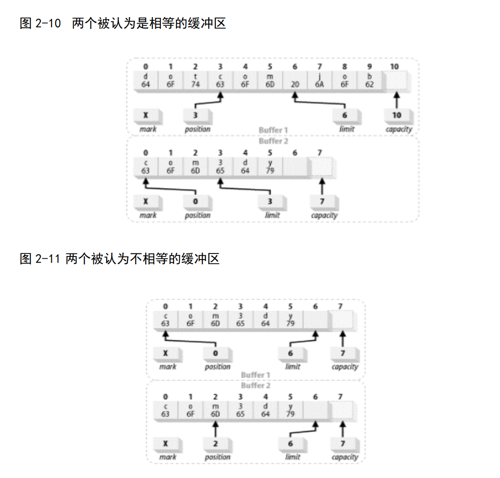

# equals
如果每个缓冲区中剩余的内容相同，那么 equals( )函数将返回 true，否则返回 false。

因为这个测试是用于严格的相等而且是可换向的。前面的程序清单中的缓冲区名称可以颠倒，
并会产生相同的结果。
两个缓冲区被认为相等的充要条件是：
* 两个对象类型相同。包含不同数据类型的 buffer 永远不会相等，而且 buffer
绝不会等于非 buffer 对象。
* 两个对象都剩余同样数量的元素。 Buffer 的容量不需要相同，而且缓冲区中剩
余数据的索引也不必相同。但每个缓冲区中剩余元素的数目（从位置到上界）必须相
同。
* 在每个缓冲区中应被 Get()函数返回的剩余数据元素序列必须一致。
如果不满足以上任意条件， 就会返回 false。
图 2-10 说明了两个属性不同的缓冲区也可以相等。

图 2-11 显示了两个相似的缓冲区，可能看起来是完全相同的缓冲区，但测试时会发现并
不相等。

 